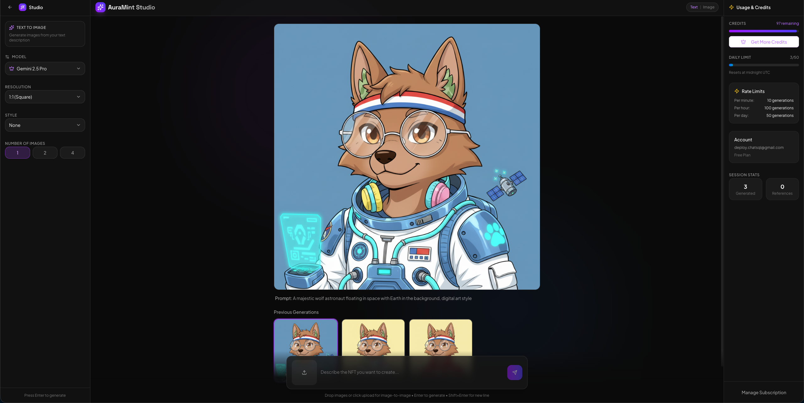

# AuraMint - AI NFT Platform

AuraMint is a modern platform for generating and minting NFTs using AI. It features a sophisticated, minimalistic chat interface that allows users to describe their desired NFTs and have them generated by AI.

## Features

- **AI-Powered Generation**: Create unique digital assets by simply describing them.
- **Modern Chat Interface**: A clean, ChatGPT-inspired interface for interacting with the AI.
- **NFT Minting**: Seamlessly mint your generated assets as NFTs.
- **Secure Authentication**: Robust user management and security.

## Screenshots

## Tech Stack

- **Frontend**: React, TypeScript, Tailwind CSS, Vite
- **Backend**: Node.js, Express
- **AI**: OpenAI / Gemini Integration
- **Database**: Supabase / PostgreSQL

## Getting Started

1.  Clone the repository
2.  Install dependencies: `npm install`
3.  Start the development server: `npm run dev`
